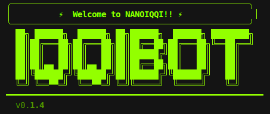
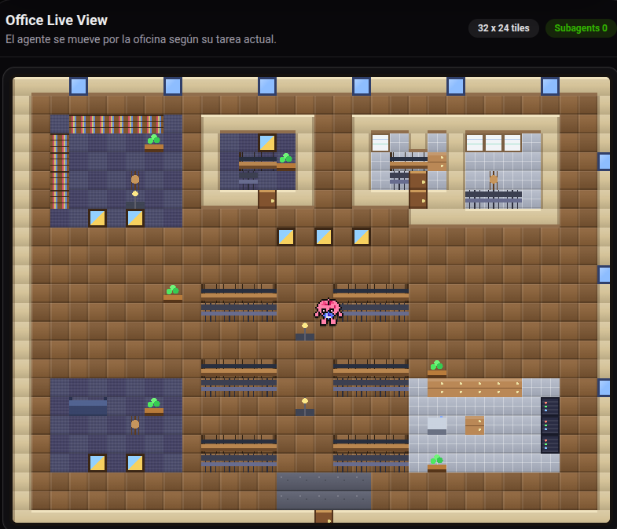

<div align="center">
  
  <h1>nanoiqqi: Ultra‑Lightweight Multi‑Agent Assistant</h1>
  <p>
    
    
    <a href="https://github.com/iqqipro/nanoiqqi"></a>
  </p>
</div>


**nanoiqqi** is an **ultra‑lightweight agent framework** built around:

- A small, readable **agent loop** (`nanoiqqi/agent/loop.py`)
- A **smart router** (`nanoiqqi/providers/smart_router.py`) that picks models based on capabilities, cost and latency
- **Background subagents** (`nanoiqqi/agent/subagent.py`) for long‑running tasks
- A built‑in **Brain Office / IQQI Office UI** (`brain-office/`) that visualizes activity in real time
- Native **skills and tools**, including **LeadsMx** for Mexico DENUE / INEGI

The core agent code (loop, tools, routing, subagents) is kept intentionally compact so it is:

- 🪶 **Easy to audit and modify**
- 🔬 **Research‑friendly**
- ⚡ **Fast to start and iterate on**

---

### IQQI Office UI

<div align="center">
  
  <p><em>Pixel‑style control room for nanoiqqi – live view of tools, subagents, and activity.</em></p>
</div>

---

## 📦 Install

**From source (recommended for development)**

```bash
git clone https://github.com/iqqipro/nanoiqqi.git
cd nanoiqqi
pip install -e .
```

**With [uv](https://github.com/astral-sh/uv)** (tool install, if you publish it locally)

```bash
uv tool install nanoiqqi
```

nanoiqqi requires **Python ≥ 3.11**.

---

## 🚀 Quick Start

> **Config path**: `~/.nanoiqqi/config.json`  
> You can reuse Claude Desktop / Cursor MCP config snippets directly.

### 1. Onboard

```bash
nanoiqqi onboard
```

This command:
- Creates `~/.nanoiqqi/config.json`
- Creates a workspace directory with `AGENTS.md`, `SOUL.md`, `USER.md`, `memory/`, and `skills/`

### 2. Configure a provider

Minimal example with **OpenRouter**:

```json
{
  "providers": {
    "openrouter": {
      "apiKey": "sk-or-v1-..."
    }
  },
  "agents": {
    "defaults": {
      "model": "anthropic/claude-3.7-sonnet"
    }
  }
}
```

For a local vLLM server:

```json
{
  "providers": {
    "vllm": {
      "apiKey": "dummy",
      "apiBase": "http://localhost:8000/v1"
    }
  },
  "agents": {
    "defaults": {
      "model": "meta-llama/Meta-Llama-3.1-8B-Instruct"
    }
  }
}
```

### 3. Chat from CLI

```bash
nanoiqqi agent
```

or

```bash
nanoiqqi agent -m "Give me a one‑paragraph status update on IQQI."
```

---

## 🧠 What nanoiqqi Provides

- **Workspace‑driven behavior**: `workspace/AGENTS.md` and `workspace/TOOLS.md` define high‑level agent and tool instructions.
- **Integrated smart router**: A single `SmartRouter` class handles main‑agent and subagent routing, scoring models by **quality, cost, latency, reliability and structure** using capability metadata.
- **First‑class subagents**: `SubagentManager` plus the `spawn` tool let the LLM offload complex tasks to focused background workers.
- **Real‑time office UI**: Every tool run, turn, and subagent lifecycle emits **activity events** to the Brain Office backend, which can be visualized with `iqqioffice.png` and the app in `brain-office/`.
- **LeadsMx as a native skill**: When configured, `LeadsMx` exposes the DENUE/INEGI directory via a rich Spanish‑language skill (`nanoiqqi/skills/leads_mx/SKILL.md`) with strict anti‑hallucination rules.

---

## 🏗️ Architecture (High Level)

### Agent loop

The core engine lives in `nanoiqqi/agent/loop.py`:

- **Input**: `InboundMessage` (CLI, Telegram, Slack, WhatsApp, Feishu, Email, QQ, DingTalk, Mochat, etc.)
- **Context**: built via `ContextBuilder` (history, memory, skills, channel metadata)
- **LLM call**: uses an `LLMProvider` – usually `SmartRouter` on top of OpenRouter or vLLM
- **Tools**: executed via `ToolRegistry` (filesystem, shell, web, LeadsMx, MCP, spawn, cron…)
- **Subagents**: delegated to `SubagentManager` when the `spawn` tool is called
- **Output**: `OutboundMessage` plus media (images generated into the workspace)

Memory is persisted under the workspace directory using `MemoryStore`, and can be consolidated automatically when conversations grow long.

### Smart Router

The smart router (`nanoiqqi/providers/smart_router.py`) provides a **five‑stage pipeline**:

1. **Request requirements**: detects tool‑calling, vision, min context length, and estimates input/output tokens.
2. **Hard gates**: filters candidate models to those that support the required features.
3. **Optional judge**: an internal “judge” model classifies each request as  
   `complexity: <simple|medium|complex>, domain: <code|general|math|agentic|unknown>`.
4. **Score + select**: scores models using:
   - Fit (including “preferred model” hints)
   - Quality (domain‑aware)
   - Cost (per‑request estimate when pricing is known)
   - Latency (from router metrics or AA ttft)
   - Reliability and structure (tool‑calling support)
5. **Execute with fallback + learning**: tries primary then provider‑diverse fallbacks, marking invalid models and updating metrics.

For **subagents**, the same router is used with `routing_profile="subagent"`, focusing on:

- Enforcing a **minimum agentic capability** based on task complexity  
- Picking a **cheap but good‑enough** model chain (no metrics recording)

---

## 🤖 Subagents: Background Workers

nanoiqqi’s subagent system (`nanoiqqi/agent/subagent.py`) lets the main agent say:

> “Handle this complex task in the background, and summarize the result for the user later.”

Key details:

- Each subagent:
  - Gets its **own focused system prompt** (time, rules, allowed tools, workspace path)
  - Shares the same **LLM provider** (usually `SmartRouter`) but has isolated message history
  - Has a limited **max iterations** and automatic history trimming at ~80k tokens
- Subagents can use **shared tools only** (filesystem, shell, web, image generation, LeadsMx, etc.)  
  – no `message` or `spawn` inside subagents.
- When a subagent finishes, it sends a **system message** back through the bus with:
  - Original task
  - Raw result
  - Instructions for the main agent to smoothly summarize it to the user.

From the LLM’s perspective, this is exposed via the `spawn` tool:

- It passes `task`, an optional `label`, and the origin channel/chat id.
- The user just sees: *“I started a background task; I’ll let you know when it’s done.”*

---

## 🧰 Built‑In Tools (IQQI Edition)

The tool surface is defined in `workspace/TOOLS.md` and implemented in `nanoiqqi/agent/tools/*`.

### File Operations

- **read_file** – read any file within the (optionally sandboxed) workspace
- **write_file** – write a full file (creating parent directories)
- **edit_file** – replace specific text fragments
- **list_dir** – list directory contents

All filesystem tools support a **`restrictToWorkspace`** mode to prevent path traversal.

### Shell Execution

- **exec** – run shell commands (with timeout and blocked dangerous patterns)

Used both interactively and for **cron‑backed reminders**:

```bash
nanoiqqi cron add --name "morning" --message "Buenos días ☀️" --cron "0 9 * * *"
nanoiqqi cron list
```

### Web Access

- **web_search** – Brave Search API integration
- **web_fetch** – fetch and extract main content (markdown or plain text)

### Image Generation

- **generate_image** – uses OpenRouter image models (e.g. Flux) to generate assets  
  Images are stored under `workspace/.nanoiqqi/generated/`.  
  Uses `providers.openrouter.apiKey` (or `tools.image.apiKey` if set).

### Communication / Session Tools

- **message** – send structured messages back through the appropriate channel
- **new_session / dump_session** – manage or export conversational context
- **cron** – manage scheduled jobs for reminders and automations

### Background Tasks

- **spawn** – launch a subagent in the background (see above)

### LeadsMx: Mexico Leads via DENUE / INEGI

The **LeadsMx** tool plus the `leads_mx` skill make **Mexico B2B prospecting a first‑class workflow**:

- Backed by the official **DENUE / INEGI API**
- 7 methods: `buscar`, `ficha`, `nombre`, `buscarEntidad`, `buscarAreaAct`, `buscarAreaActEstr`, `cuantificar`
- Rich Spanish‑language SKILL with:
  - Guardrails (never send empty strings; never invent IDs or SCIAN codes)
  - Smart defaults (25‑record pagination, “0/00” conventions)
  - Heuristics for mapping everyday language (e.g. *“restaurantes en Jalisco”*) to correct parameters
- Tight integration with other skills:
  - `leads_mx_localidades` and `leads_mx_municipios` for location codes

To enable:

```json
{
  "tools": {
    "leads_mx": {
      "token": "INEGI_DENUE_TOKEN"
    }
  }
}
```

---

## 🎯 Skills

Skill system lives under `nanoiqqi/skills/` and follows the **OpenClaw‑style** SKILL format:

- YAML front‑matter (name, description, metadata)
- Markdown instructions (how and when to call tools)

### Included skills (curated for IQQI)

- **`leads_mx`** – Mexico establishments via DENUE (see above)
- **`leads_mx_localidades` / `leads_mx_municipios`** – catalog helpers for geographic codes
- **`github`** – use `gh` CLI for PRs, issues, and reviews
- **`weather`** – wttr.in + Open‑Meteo for simple forecasts
- **`summarize`** – long‑form URL / file / YouTube summaries
- **`tmux`** – remote tmux control for ops workflows
- **`clawhub`** – discover and install public skills from ClawHub
- **`skill-creator`** – scaffold new skills directly from within the agent
- **`memory`** – long‑term memory and history
- **`cron`** – scheduled reminders and cron-backed jobs

Skills are loaded dynamically by `nanoiqqi/agent/skills.py` and surfaced to the LLM via system context, so you can iterate on them without restarting the entire stack.

---

## 🧩 MCP (Model Context Protocol)

nanoiqqi can attach to any compatible **MCP server**, local or remote.

Add MCP servers under `tools.mcpServers` in `config.json`:

```json
{
  "tools": {
    "mcpServers": {
      "filesystem": {
        "command": "npx",
        "args": ["-y", "@modelcontextprotocol/server-filesystem", "/path/to/dir"]
      },
      "my-remote-mcp": {
        "url": "https://example.com/mcp/",
        "headers": {
          "Authorization": "Bearer xxxxx"
        }
      }
    }
  }
}
```

On startup, the agent connects these servers and registers their tools into the main `ToolRegistry`. MCP tools are **only available to the main agent**, not to subagents.

---

## 💬 Channels (Chat Apps)

The `nanoiqqi/channels/` package wires the agent into multiple chat backends via the **gateway** process:

```bash
nanoiqqi gateway
```

Supported channels (per `config.json`):

| Channel      | Notes                                           |
|--------------|-------------------------------------------------|
| **Telegram** | Bot token from `@BotFather`                     |
| **Discord**  | Bot token + Message Content intent              |
| **WhatsApp** | Device link via QR (`nanoiqqi channels login`)  |
| **Feishu**   | WebSocket long‑connection (no public IP needed) |
| **Mochat**   | Claw‑style IM; can auto‑configure from a skill  |
| **DingTalk** | Stream mode                                     |
| **Slack**    | Socket Mode (no public URL)                     |
| **Email**    | IMAP + SMTP (Gmail app password etc.)           |
| **QQ**       | botpy WebSocket; private chats only (for now)   |

Each channel supports an `allowFrom` allowlist in `config.json` to restrict who can talk to your agent.

---

## 🖥️ IQQI Office / Brain Office

The **Brain Office** app (see `brain-office/`) powers the IQQI Office UI:

- Backend: **FastAPI** (`/events` for POST, `/ws` for WebSocket)
- Frontend: **React + Vite + TypeScript** (served at `/` in production)
- Agent: sends events for **tool_start**, **tool_end**, **waiting_input**, **turn_end**, **subagent_start**, **subagent_end**

### Run Brain Office locally

```bash
pip install -e ".[brain-office]"

cd brain-office/backend
uvicorn app:app --reload --port 8765

cd ../frontend
npm install
npm run dev
```

Open `http://localhost:5173` to see the UI.  
By default, nanoiqqi sends events to `http://localhost:8765`.

In `~/.nanoiqqi/config.json` you can override:

```json
{
  "brainOffice": {
    "url": "http://localhost:8765"
  }
}
```

---

## ⚙️ Configuration Overview

**Config file**: `~/.nanoiqqi/config.json`

High‑level structure:

```json
{
  "providers": { ... },
  "agents": {
    "defaults": {
      "model": "openrouter/minimax/minimax-m2.5",
      "temperature": 0.7,
      "always_skills": []
    }
  },
  "routing": {
    "aliases": {},
    "fallbackModels": [],
    "heartbeatModel": "openrouter/google/gemini-2.5-flash-lite",
    "heartbeatIntervalS": 3300,
    "policy": "balanced",
    "judgeModel": "openrouter/google/gemini-2.5-flash-lite"
  },
  "channels": {
    "telegram": { "enabled": true, "token": "..." }
  },
  "tools": {
    "restrictToWorkspace": true,
    "image": { "model": "bytedance-seed/seedream-4.5" },
    "smart_router": { "apiKey": "" },
    "leads_mx": { "token": "..." },
    "mcpServers": {}
  },
  "brainOffice": {
    "url": "http://localhost:8765"
  }
}
```

Generated config has no API keys by default; add `providers.openrouter.apiKey` (and others) as needed.

#### API keys (resumen)

| Use | Where in config | Get key |
|-----|-----------------|---------|
| LLM (chat) and image generation | `providers.openrouter.apiKey` | [openrouter.ai](https://openrouter.ai/keys) |
| Smart router (automatic model selection) | `tools.smart_router.apiKey` | [artificialanalysis.ai](https://artificialanalysis.ai) (optional) |

Image generation uses `tools.image.apiKey` if set, otherwise `providers.openrouter.apiKey`.

### Providers (examples)

The following providers are supported out of the box (see `nanoiqqi/providers/registry.py`):

- `openrouter` – primary router backing (recommended)
- `anthropic`, `openai`, `deepseek`, `gemini`, `minimax`, `moonshot`, `siliconflow`, `zhipu`, `volcengine`, `dashscope`
- `vllm` – any local OpenAI‑compatible server
- `custom` – arbitrary OpenAI‑compatible API (LM Studio, self‑hosted, Azure, etc.)
- `openai_codex`, `github_copilot` – OAuth‑based providers via `nanoiqqi provider login ...`

All of these plug into the same `SmartRouter` pipeline.

---

## 🛠️ CLI Reference

| Command                               | Description                               |
|---------------------------------------|-------------------------------------------|
| `nanoiqqi onboard`                    | Initialize config & workspace             |
| `nanoiqqi agent`                      | Interactive chat                          |
| `nanoiqqi agent -m "..."`             | One‑shot chat                             |
| `nanoiqqi agent --logs`               | Chat with streaming logs                  |
| `nanoiqqi gateway`                    | Start channel gateway                     |
| `nanoiqqi status`                     | Show provider / channel status            |
| `nanoiqqi provider login openai-codex`| OAuth login for OpenAI Codex              |
| `nanoiqqi channels login`             | Link WhatsApp (QR scan)                   |
| `nanoiqqi channels status`            | Show channel status                       |
| `nanoiqqi cron add ...`               | Add a scheduled job                       |
| `nanoiqqi cron list`                  | List cron jobs                            |
| `nanoiqqi cron remove <job_id>`       | Remove a cron job                         |

Exit interactive mode with `exit`, `quit`, `/exit`, `/quit`, `:q`, or `Ctrl+D`.

---

## 🐳 Docker

Example (adapted to this repo; see `docker-compose.yml` for exact service names):

```bash
# Build image
docker build -t nanoiqqi .

# First‑time setup
docker run -v ~/.nanoiqqi:/root/.nanoiqqi --rm nanoiqqi onboard
vim ~/.nanoiqqi/config.json  # add API keys

# Run gateway
docker run -v ~/.nanoiqqi:/root/.nanoiqqi -p 18790:18790 nanoiqqi gateway

# One‑shot CLI
docker run -v ~/.nanoiqqi:/root/.nanoiqqi --rm nanoiqqi agent -m "Hello from Docker"
```

When using `docker compose`, Brain Office and the agent can be run in a single stack so the IQQI Office UI is always live.

---


## ⚙️ Configuration

Config file: `~/.nanoiqqi/config.json`

### Providers

> [!TIP]
> - **Groq** provides free voice transcription via Whisper. If configured, Telegram voice messages will be automatically transcribed.
> - **Zhipu Coding Plan**: If you're on Zhipu's coding plan, set `"apiBase": "https://open.bigmodel.cn/api/coding/paas/v4"` in your zhipu provider config.
> - **MiniMax (Mainland China)**: If your API key is from MiniMax's mainland China platform (minimaxi.com), set `"apiBase": "https://api.minimaxi.com/v1"` in your minimax provider config.
> - **VolcEngine Coding Plan**: If you're on VolcEngine's coding plan, set `"apiBase": "https://ark.cn-beijing.volces.com/api/coding/v3"` in your volcengine provider config.

| Provider | Purpose | Get API Key |
|----------|---------|-------------|
| `custom` | Any OpenAI-compatible endpoint (direct, no LiteLLM) | — |
| `openrouter` | LLM (recommended, access to all models) | [openrouter.ai](https://openrouter.ai) |
| `anthropic` | LLM (Claude direct) | [console.anthropic.com](https://console.anthropic.com) |
| `openai` | LLM (GPT direct) | [platform.openai.com](https://platform.openai.com) |
| `deepseek` | LLM (DeepSeek direct) | [platform.deepseek.com](https://platform.deepseek.com) |
| `groq` | LLM + **Voice transcription** (Whisper) | [console.groq.com](https://console.groq.com) |
| `gemini` | LLM (Gemini direct) | [aistudio.google.com](https://aistudio.google.com) |
| `minimax` | LLM (MiniMax direct) | [platform.minimax.io](https://platform.minimax.io) |
| `aihubmix` | LLM (API gateway, access to all models) | [aihubmix.com](https://aihubmix.com) |
| `siliconflow` | LLM (SiliconFlow/硅基流动) | [siliconflow.cn](https://siliconflow.cn) |
| `volcengine` | LLM (VolcEngine/火山引擎) | [volcengine.com](https://www.volcengine.com) |
| `dashscope` | LLM (Qwen) | [dashscope.console.aliyun.com](https://dashscope.console.aliyun.com) |
| `moonshot` | LLM (Moonshot/Kimi) | [platform.moonshot.cn](https://platform.moonshot.cn) |
| `zhipu` | LLM (Zhipu GLM) | [open.bigmodel.cn](https://open.bigmodel.cn) |
| `vllm` | LLM (local, any OpenAI-compatible server) | — |
| `openai_codex` | LLM (Codex, OAuth) | `nanoiqqi provider login openai-codex` |
| `github_copilot` | LLM (GitHub Copilot, OAuth) | `nanoiqqi provider login github-copilot` |

<details>
<summary><b>OpenAI Codex (OAuth)</b></summary>

Codex uses OAuth instead of API keys. Requires a ChatGPT Plus or Pro account.

**1. Login:**
```bash
nanoiqqi provider login openai-codex
```

**2. Set model** (merge into `~/.nanoiqqi/config.json`):
```json
{
  "agents": {
    "defaults": {
      "model": "openai-codex/gpt-5.1-codex"
    }
  }
}
```

**3. Chat:**
```bash
nanoiqqi agent -m "Hello!"
```

> Docker users: use `docker run -it` for interactive OAuth login.

</details>

<details>
<summary><b>Custom Provider (Any OpenAI-compatible API)</b></summary>

Connects directly to any OpenAI-compatible endpoint — LM Studio, llama.cpp, Together AI, Fireworks, Azure OpenAI, or any self-hosted server. Bypasses LiteLLM; model name is passed as-is.

```json
{
  "providers": {
    "custom": {
      "apiKey": "your-api-key",
      "apiBase": "https://api.your-provider.com/v1"
    }
  },
  "agents": {
    "defaults": {
      "model": "your-model-name"
    }
  }
}
```

> For local servers that don't require a key, set `apiKey` to any non-empty string (e.g. `"no-key"`).

</details>

<details>
<summary><b>vLLM (local / OpenAI-compatible)</b></summary>

Run your own model with vLLM or any OpenAI-compatible server, then add to config:

**1. Start the server** (example):
```bash
vllm serve meta-llama/Llama-3.1-8B-Instruct --port 8000
```

**2. Add to config** (partial — merge into `~/.nanoiqqi/config.json`):

*Provider (key can be any non-empty string for local):*
```json
{
  "providers": {
    "vllm": {
      "apiKey": "dummy",
      "apiBase": "http://localhost:8000/v1"
    }
  }
}
```

*Model:*
```json
{
  "agents": {
    "defaults": {
      "model": "meta-llama/Llama-3.1-8B-Instruct"
    }
  }
}
```

</details>

<details>
<summary><b>Adding a New Provider (Developer Guide)</b></summary>

nanoiqqi uses a **Provider Registry** (`nanoiqqi/providers/registry.py`) as the single source of truth.
Adding a new provider only takes **2 steps** — no if-elif chains to touch.

**Step 1.** Add a `ProviderSpec` entry to `PROVIDERS` in `nanoiqqi/providers/registry.py`:

```python
ProviderSpec(
    name="myprovider",                   # config field name
    keywords=("myprovider", "mymodel"),  # model-name keywords for auto-matching
    env_key="MYPROVIDER_API_KEY",        # env var for LiteLLM
    display_name="My Provider",          # shown in `nanoiqqi status`
    litellm_prefix="myprovider",         # auto-prefix: model → myprovider/model
    skip_prefixes=("myprovider/",),      # don't double-prefix
)
```

**Step 2.** Add a field to `ProvidersConfig` in `nanoiqqi/config/schema.py`:

```python
class ProvidersConfig(BaseModel):
    ...
    myprovider: ProviderConfig = ProviderConfig()
```

That's it! Environment variables, model prefixing, config matching, and `nanoiqqi status` display will all work automatically.

**Common `ProviderSpec` options:**

| Field | Description | Example |
|-------|-------------|---------|
| `litellm_prefix` | Auto-prefix model names for LiteLLM | `"dashscope"` → `dashscope/qwen-max` |
| `skip_prefixes` | Don't prefix if model already starts with these | `("dashscope/", "openrouter/")` |
| `env_extras` | Additional env vars to set | `(("ZHIPUAI_API_KEY", "{api_key}"),)` |
| `model_overrides` | Per-model parameter overrides | `(("kimi-k2.5", {"temperature": 1.0}),)` |
| `is_gateway` | Can route any model (like OpenRouter) | `True` |
| `detect_by_key_prefix` | Detect gateway by API key prefix | `"sk-or-"` |
| `detect_by_base_keyword` | Detect gateway by API base URL | `"openrouter"` |
| `strip_model_prefix` | Strip existing prefix before re-prefixing | `True` (for AiHubMix) |

</details>


### MCP (Model Context Protocol)

> [!TIP]
> The config format is compatible with Claude Desktop / Cursor. You can copy MCP server configs directly from any MCP server's README.

nanoiqqi supports [MCP](https://modelcontextprotocol.io/) — connect external tool servers and use them as native agent tools.

Add MCP servers to your `config.json`:

```json
{
  "tools": {
    "mcpServers": {
      "filesystem": {
        "command": "npx",
        "args": ["-y", "@modelcontextprotocol/server-filesystem", "/path/to/dir"]
      },
      "my-remote-mcp": {
        "url": "https://example.com/mcp/",
        "headers": {
          "Authorization": "Bearer xxxxx"
        }
      }
    }
  }
}
```

Two transport modes are supported:

| Mode | Config | Example |
|------|--------|---------|
| **Stdio** | `command` + `args` | Local process via `npx` / `uvx` |
| **HTTP** | `url` + `headers` (optional) | Remote endpoint (`https://mcp.example.com/sse`) |

MCP tools are automatically discovered and registered on startup. The LLM can use them alongside built-in tools — no extra configuration needed.


### Security

> [!TIP]
> For production deployments, set `"restrictToWorkspace": true` in your config to sandbox the agent.

| Option | Default | Description |
|--------|---------|-------------|
| `tools.restrictToWorkspace` | `false` | When `true`, restricts **all** agent tools (shell, file read/write/edit, list) to the workspace directory. Prevents path traversal and out-of-scope access. |
| `channels.*.allowFrom` | `[]` (allow all) | Whitelist of user IDs. Empty = allow everyone; non-empty = only listed users can interact. |


## CLI Reference

| Command | Description |
|---------|-------------|
| `nanoiqqi onboard` | Initialize config & workspace |
| `nanoiqqi agent -m "..."` | Chat with the agent |
| `nanoiqqi agent` | Interactive chat mode |
| `nanoiqqi agent --no-markdown` | Show plain-text replies |
| `nanoiqqi agent --logs` | Show runtime logs during chat |
| `nanoiqqi gateway` | Start the gateway |
| `nanoiqqi status` | Show status |
| `nanoiqqi provider login openai-codex` | OAuth login for providers |
| `nanoiqqi channels login` | Link WhatsApp (scan QR) |
| `nanoiqqi channels status` | Show channel status |

Interactive mode exits: `exit`, `quit`, `/exit`, `/quit`, `:q`, or `Ctrl+D`.

<details>
<summary><b>Scheduled Tasks (Cron)</b></summary>

```bash
# Add a job
nanoiqqi cron add --name "daily" --message "Good morning!" --cron "0 9 * * *"
nanoiqqi cron add --name "hourly" --message "Check status" --every 3600

# List jobs
nanoiqqi cron list

# Remove a job
nanoiqqi cron remove <job_id>
```

</details>

## 🐳 Docker

> [!TIP]
> The `-v ~/.nanoiqqi:/root/.nanoiqqi` flag mounts your local config directory into the container, so your config and workspace persist across container restarts.

### Docker Compose

```bash
docker compose run --rm nanoiqqi-cli onboard   # first-time setup
vim ~/.nanoiqqi/config.json                    # add API keys
docker compose up -d nanoiqqi-gateway           # start gateway
```

```bash
docker compose run --rm nanoiqqi-cli agent -m "Hello!"   # run CLI
docker compose logs -f nanoiqqi-gateway                 # view logs
docker compose down                                      # stop
```

### Docker

```bash
# Build the image
docker build -t nanoiqqi .

# Initialize config (first time only)
docker run -v ~/.nanoiqqi:/root/.nanoiqqi --rm nanoiqqi onboard

# Edit config on host to add API keys
vim ~/.nanoiqqi/config.json

# Run gateway (connects to enabled channels, e.g. Telegram/Discord/Mochat)
docker run -v ~/.nanoiqqi:/root/.nanoiqqi -p 18790:18790 nanoiqqi gateway

# Or run a single command
docker run -v ~/.nanoiqqi:/root/.nanoiqqi --rm nanoiqqi agent -m "Hello!"
docker run -v ~/.nanoiqqi:/root/.nanoiqqi --rm nanoiqqi status
```

## 📁 Project Structure

```
nanoiqqi/
├── agent/          # 🧠 Core agent logic
│   ├── loop.py     #    Agent loop (LLM ↔ tool execution)
│   ├── context.py  #    Prompt builder
│   ├── memory.py   #    Persistent memory
│   ├── skills.py   #    Skills loader
│   ├── subagent.py #    Background task execution
│   ├── activity_events.py  # Activity event types (Brain Office)
│   ├── activity_sink.py   # Event sink for Brain Office (always on)
│   └── tools/      #    Built-in tools (incl. spawn)
├── brain-office/   # 🖥️ Brain Office web UI (agent activity in real time, always on)
├── skills/         # 🎯 Bundled skills (github, weather, tmux...)
├── channels/       # 📱 Chat channel integrations
├── bus/            # 🚌 Message routing
├── cron/           # ⏰ Scheduled tasks
├── heartbeat/      # 💓 Proactive wake-up
├── providers/      # 🤖 LLM providers (OpenRouter, etc.)
├── session/        # 💬 Conversation sessions
├── config/         # ⚙️ Configuration
└── cli/            # 🖥️ Commands
```

## Brain Office

[Brain Office](brain-office/README.md) is a small web app that shows the agent as a character in a pixel-art office. The character state updates in real time (reading, typing, running commands, waiting for input). **Activity events are always sent**; you only set `brainOffice.url` if the backend is not at `http://localhost:8765`.

- **Run:** Start the backend (`cd brain-office/backend && uvicorn app:app --port 8765`), then the frontend (`cd brain-office/frontend && npm run dev`). Open http://localhost:5173. Or use Docker: `docker compose up -d brain-office` and open http://localhost:8765.
- **Configure URL (optional):** In `~/.nanoiqqi/config.json` set `brainOffice.url: "http://localhost:8765"` (or `http://brain-office:8765` when the agent runs in Docker).
- **Event flow:** nanoiqqi → POST `/events` → Backend → WebSocket `/ws` → Frontend.

See [brain-office/README.md](brain-office/README.md) for details.

## 🤝 Contributing

We keep nanoiqqi **intentionally small and opinionated** so it stays easy to audit and fork.

- Open issues or PRs in [`iqqipro/nanoiqqi`](https://github.com/iqqipro/nanoiqqi).
- To extend nanoiqqi you can:
  - Add providers in `nanoiqqi/providers/registry.py`
  - Add tools in `nanoiqqi/agent/tools/` and register them via `register_shared_tools`
  - Add skills in `nanoiqqi/skills/` with `SKILL.md` front‑matter

---

## ⚖️ License

This project is licensed under the **MIT License** – see `LICENSE` for details.
